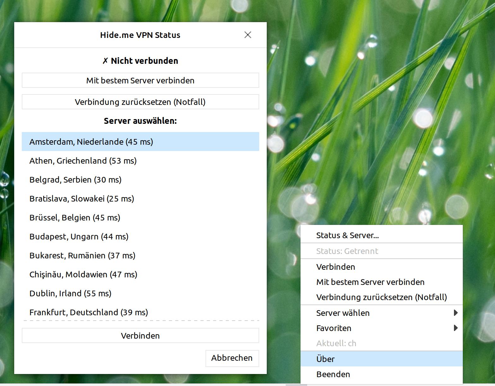

# Hide.me VPN GUI for Linux

> I just vibecoded a GUI taskbar icon for hide.me VPN on Linux because I got tired of typing `systemctl start hide.me@nl` every time. Now it's just a click away in the system tray with a nice server selection dialog.

[](LICENSE)
[](https://www.python.org/downloads/)



## ⚠️ Disclaimer

**This is an unofficial GUI for the hide.me VPN CLI - use at your own risk!**

- No warranty or guarantees for functionality, security, or privacy
- Not officially endorsed by hide.me
- Requires root privileges via PolicyKit - review code before installation
- Use at your own responsibility

## ✨ Features

- **System Tray Integration**: AppIndicator3 with StatusIcon fallback
- **One-Click Connection**: Connect/disconnect with a single click
- **Dynamic Server List**: Fetches latest servers from hide.me/de/network at startup
- **Offline Server Cache**: Persisted server list for no-internet scenarios
- **Server Selection Dialog**: Browse and select servers even when already connected
- **Per-Server Latency**: Ping shown next to each server entry in the dialog
- **Best Location**: Auto-select fastest reachable server
- **Favorites Menu**: Save commonly used servers for quick reconnect
- **Emergency Reset Everywhere**: Available in menu, dialog, and CLI (`--emergency-reset`)
- **Update Check on Startup**: Background GitHub release/tag check
- **Live Status Display**: Visual connection status in icon and tooltip
- **Desktop Notifications**: Connection feedback via libnotify
- **Password-Free Control**: PolicyKit integration for sudo group members
- **Autostart Support**: GUI starts automatically on login

## 📦 Installation

### Prerequisites

- [hide.me VPN CLI](https://hide.me/en/software/linux) installed and configured
- Python 3.6+
- GTK 3
- PolicyKit (pkexec)
- Linux with GTK3 desktop (Ubuntu, Mint, Debian, Pop!_OS, etc.)

### Quick Install

```bash
# Clone the repository
git clone https://github.com/hirntot/hideme-vpn-gui.git
cd hideme-vpn-gui

# Run installation script
sudo ./hideme-gui-install.sh
```

The installer will:
- Check for hide.me CLI installation
- Install required Python packages
- Copy GUI to `/usr/local/bin/hideme-vpn-gui`
- Create desktop integration (`.desktop` file)
- Install PolicyKit rule for password-free VPN control
- Set up autostart

## 🚀 Usage

### Starting the GUI

**Application Menu**: Look for "Hide.me VPN" in System/Network

**Terminal**:
```bash
hideme-vpn-gui
```

**Autostart**: GUI starts automatically on login after installation

### Controls

- **Left-click icon**: Open status dialog or server selection
- **Right-click icon**: Quick access menu
- **Connect**: Select server and click connect
- **Disconnect**: Click disconnect in menu
- **Change server**: Select from list, automatically reconnects if active
- **Best location**: Connect using lowest-latency server
- **Favorites**: Add/remove current server in tray menu
- **Emergency reset**: Trigger directly from tray/dialog

### Command Line Helpers

```bash
# Emergency reset from anywhere
hideme-vpn-gui --emergency-reset
```

## 🛠️ Included Files

```
hideme-notifiy.py              # Main GUI application (~650 lines)
hideme-gui-install.sh          # Installation script
hideme-gui-uninstall.sh        # Uninstallation script
50-hideme-vpn.rules            # PolicyKit rule
hideme-emergency-reset.sh      # Network reset tool
LICENSE                        # MIT License
HIDEME-GUI-README.md           # Detailed documentation (German)
```

## 🔧 Troubleshooting

### Password prompt despite PolicyKit

```bash
# Restart PolicyKit service
sudo systemctl restart polkit.service

# Verify you're in sudo group
groups
```

### Network issues after VPN

```bash
# Run emergency reset from anywhere
hideme-vpn-gui --emergency-reset

# Or run standalone script
sudo ./hideme-emergency-reset.sh
```

### GUI not starting

```bash
# Check hide.me CLI installation
ls /opt/hide.me/hide.me

# Check Python dependencies
python3 -c "import gi; gi.require_version('Gtk', '3.0'); from gi.repository import Gtk"
```

### System tray icon not visible

```bash
# Install AppIndicator3
sudo apt install gir1.2-appindicator3-0.1

# GNOME users: Install "AppIndicator Support" extension
```

## 📋 Technical Details

- **Language**: Python 3 with GTK 3.0
- **VPN Control**: systemctl + hide.me CLI (`hide.me@SERVER.service`)
- **Privilege Escalation**: PolicyKit (pkexec) - no password prompts for sudo group
- **Server Discovery**: Parses hide.me/de/network website at startup
- **Server Fallback**: Cached online server list stored in user config
- **Version Check**: GitHub API check in non-blocking startup thread
- **Threading**: Non-blocking UI operations

## 🗑️ Uninstallation

```bash
sudo ./hideme-gui-uninstall.sh
```

## 📝 License

MIT License - see [LICENSE](LICENSE) file for details

Copyright © 2025-2026 [RechnerLotsen](https://rechnerlotsen.com)

## 🙏 Credits

**Developed by**: RechnerLotsen  
**Based on**: [hide.me VPN CLI](https://hide.me)
**AI workflow**: Built iteratively with Cursor

## 📚 Documentation

- [Detailed Documentation (German)](HIDEME-GUI-README.md)
- [Emergency Reset Guide](HIDEME-GUI-README.md#-notfall-vpn-zurücksetzen-für-fernwartung)

## 🤝 Contributing

Contributions welcome! Feel free to:
- Report bugs via GitHub issues
- Submit pull requests
- Suggest new features

## ⭐ Support

If this saved you from typing VPN commands, consider giving it a star!

---

**Made with ❤️ by RechnerLotsen** - Because VPN should be simple!
